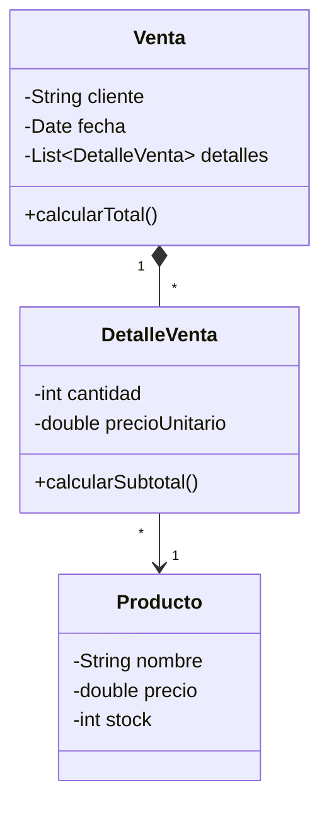

# Sílabo del curso de Programación Orientada a Objetos

## 1. Datos generales

**Curso:** Programación Orientada a Objetos  
**Abreviación:** POO  
**Carrera profesional:** Ingeniería de Sistemas  
**Institución:** UPeU  
**Duración:** 3 unidades y 16 sesiones teórico-prácticas  
**Entorno base:** IntelliJ IDEA con Maven  
**Lenguaje de trabajo:** Java

---

## 2. Descripción del curso

El curso orienta al estudiante en la construcción progresiva de un sistema de escritorio mediante modelado orientado a objetos, interfaz gráfica y persistencia ligera. La secuencia pedagógica parte de clases, objetos y relaciones, continúa con arquitectura, acceso a datos y GUI, y culmina con un proyecto integrador documentado.

---

## 3. Propósito formativo

Al finalizar el curso, el estudiante será capaz de diseñar, implementar y sustentar una aplicación de escritorio basada en objetos, integrando modelado del dominio, encapsulamiento, herencia, persistencia con base de datos relacional, interfaz gráfica y organización modular del código.

### Producto del curso

Sistema de ventas orientado a objetos con interfaz gráfica en JavaFX, persistencia con SQLite y organización por paquetes o capas para resolver un problema aplicado.

---

## 4. Enfoque metodológico

Cada sesión combina explicación breve, modelado del docente, práctica guiada, trabajo incremental sobre el proyecto y cierre con verificación. El patrón de trabajo del curso es:

```text
Analizar el caso -> modelar clases -> implementar -> probar -> integrar -> refinar
```

La unidad de avance no es un cuaderno aislado, sino la evolución continua de un proyecto en IntelliJ IDEA.

---

## 5. Evaluación del aprendizaje

La evaluación es continua y basada en evidencias de diseño e implementación.

### Criterios generales

- Modela correctamente entidades, atributos y relaciones del dominio.
- Aplica encapsulamiento y responsabilidad de clase con criterio.
- Usa colecciones, herencia y polimorfismo donde corresponde.
- Organiza el código por capas o paquetes de forma coherente.
- Implementa operaciones CRUD en memoria y luego sobre base de datos.
- Integra GUI, lógica y persistencia sin romper el flujo principal.
- Documenta, prueba y explica decisiones técnicas del proyecto.

### Evidencias

- Avances del proyecto por unidad.
- Prácticas guiadas y retos de sesión.
- Evaluaciones de unidad.
- Presentación y sustentación del proyecto final.

---

## 6. Organización por unidades

### Unidad 1: Fundamentos de la Programación Orientada a Objetos

**Producto de unidad:** aplicación funcional en memoria con clases, relaciones entre objetos, colecciones y operaciones principales del dominio.

- S1. Clases, objetos, atributos, métodos y responsabilidad de clase.
- S2. Encapsulamiento, constructores y control del estado.
- S3. Modelado básico del dominio, asociaciones, composición y colecciones.
- S4. Herencia, reutilización y polimorfismo aplicado.
- S5. CRUD en memoria con ArrayList, búsqueda y ordenamiento.
- S6. Evaluación de la unidad 1.

### Unidad 2: Aplicación de escritorio con GUI y base de datos

**Producto de unidad:** aplicación de escritorio funcional con arquitectura por capas, interfaz gráfica en JavaFX y persistencia en base de datos relacional.

- S7. Arquitectura y conexión a base de datos relacional con JDBC y SQLite.
- S8. Patrón DAO y operaciones CRUD.
- S9. Interfaz gráfica con JavaFX, formularios, componentes, eventos y navegación.
- S10. Registro, consulta, edición y eliminación desde GUI.
- S11. Validación de datos, integración GUI-lógica-datos y pruebas de flujo principal.
- S12. Evaluación de la unidad 2.

### Unidad 3: Proyecto integrador del curso

**Producto de unidad:** integración de U1 y U2 en un sistema completo de escritorio con modelo orientado a objetos, interfaz gráfica, persistencia y organización modular.

- S13. Ensamblaje del modelo, GUI y persistencia.
- S14. Manejo de errores, refinamiento del diseño y cierre funcional.
- S15. Documentación, demostración y sustentación.
- S16. Evaluación final del proyecto integrador.

---

## 7. Stack tecnológico propuesto

1. Java como lenguaje orientado a objetos.
2. Maven para dependencias, compilación y ejecución.
3. IntelliJ IDEA como entorno base de trabajo.
4. JavaFX con FXML y MVC para interfaz gráfica.
5. JDBC para acceso a datos.
6. SQLite como base de datos local.

## 8. Modelo de referencia del proyecto integrador final

El siguiente diagrama no corresponde a la sesión 1. Se presenta como referencia del producto final del curso, una vez que el estudiante haya avanzado por modelado básico, encapsulamiento, colecciones, herencia, persistencia e interfaz gráfica.



Durante las primeras sesiones, el modelado debe comenzar con clases simples y cercanas, por ejemplo `Producto` con `Categoria`, o bien `Cliente`, `Proveedor` y `Usuario` como entidades independientes. La generalización con `Persona` y sus clases derivadas se introduce recién en la sesión de herencia.

## 9. Estructura base de carpetas

```text
sistema-ventas-poo/
├── pom.xml
├── data/
│   └── ventas.db
└── src/
	└── main/
		├── java/
		│   └── app/
		│       ├── model/
		│       ├── controlador/
		│       ├── dao/
		│       └── util/
		└── resources/
			├── vista/
			├── css/
			└── img/
```

## 10. Resultado esperado del curso

Al cierre del semestre, el estudiante debe contar con un proyecto ejecutable en IntelliJ IDEA, con modelo de dominio coherente, operaciones CRUD, interfaz gráfica funcional, conexión a SQLite y documentación suficiente para presentar y sustentar la solución.